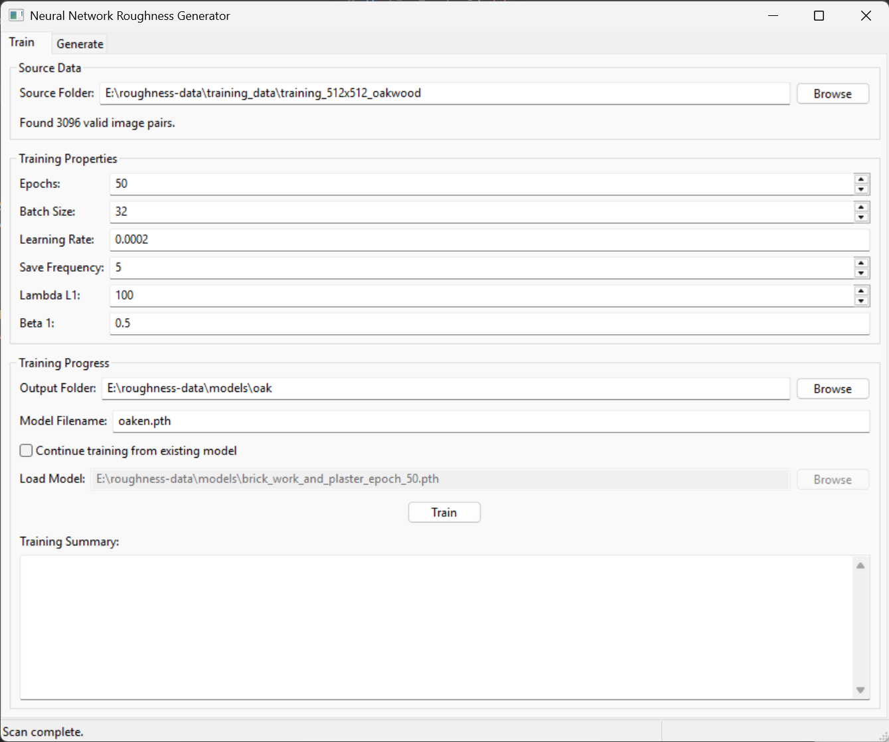
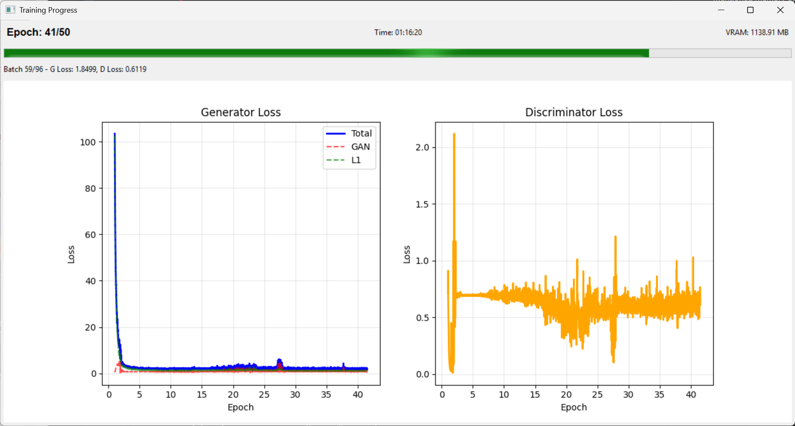
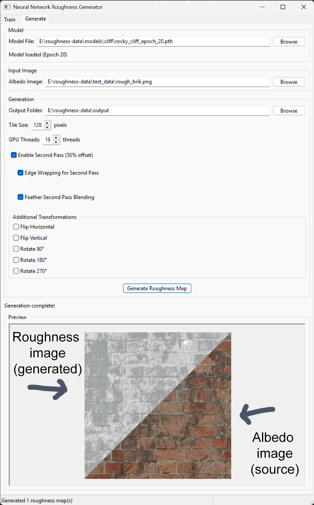

# Neural Network Roughness Generator

> This program has been created using github copilot, mostly using Claude Sonnet 4 and Gemini 2.5 in Agent mode. Programmed over a weekend, its not perfect but is fully useable!. You will need a GPU for best results (Nvidia). Even (most of) this readme has been created using them!.

This is a python wxPython application for training and running pix2pix conditional GANs to generate roughness maps from albedo images. The generated image(s) is of use in PBR textures (used in 3d modeling/modern games). The idea is to generate the 'Roughness' texture based on a 'Albedo' texture.







> The main motivation is to use AI to push the limits of my own knowledge (neural
network used for image generating). As such I dont fully understand how parts of this program works!!.

## 🚀 Key Features

### Training Pipeline

- **Advanced pix2pix cGAN training** with parameter control
- **Luminosity conversion** for albedo images with adaptive normalization
- **GPU acceleration** with CUDA support (automatic fallback to CPU)
- **Live training progress** with real-time loss and memory charts
- **Continue training** from existing model checkpoints
- **Automatic model checkpointing** with configurable save frequency
- **Real-time sample generation** during training for progress monitoring

### Generation Pipeline

- **High-resolution generation** with tiled processing for large images
- **Multiple transformation variants** - generate flipped and rotated versions automatically
- **Interactive preview system** with multi-image support and navigation
- **Edge blending** for seamless tile stitching
- **Second pass processing** with 50% offset for reduced seams
- **Seamless tiling support** for tileable texture generation
- **Advanced tiled processing** with GPU threading and memory optimization
- **Memory-efficient processing** handles images larger than GPU memory

### User Interface

- **Intuitive wxPython GUI** with comprehensive tooltips
- **Settings persistence** - all preferences automatically saved including current tab
- **Smart window management** - main window hides during training, returns after completion
- **Real-time validation** of training data and parameters
- **Progress tracking** with detailed status updates
- **Interactive image viewer** with smooth navigation

## 📋 Requirements

- Python 3.7+
- CUDA-compatible GPU (recommended) or CPU
- 4GB+ GPU memory for training (adjustable with batch size)
- See `requirements.txt` for complete dependencies

### Core Dependencies

``` txt
wxpython==4.2.1
torch>=2.0.0
torchvision>=0.15.0
pillow>=10.0.0
numpy>=1.24.0
matplotlib>=3.7.0
tqdm>=4.65.0
opencv-python>=4.8.0
```

## 🔧 Installation

> This was written on windows, dont know if it work on other machine types.

1. **Clone the repository**

   ```bash
   git clone https://github.com/sgreener/game-dev-roughness-generator.git
   cd neural-network-roughness-generate
   ```

2. (optional) **Create virtual environment**

   ``` bash
   python -m venv .venv

   .venv/scripts/activate
   ```

   This will create a virtual environment, so future dependencies are installed to it rather then the master copy of python you have installed on your systyem.

   You then nee to activate it, ina command prompt you can do this via `.venv/scripts/activate`. Note, If you are installing in a terminal of vscode, you can pick the environment used in the editor.

3. **Install dependencies**

   ```bash
   pip install -r requirements.txt
   ```

4. (to enable gpu support) **Install pytorch**

   Depending on the version of the GPU you have....

   For CUDA 11.8...

   ``` bash
   pip install torch torchvision torchaudio --index-url https://download.pytorch.org/whl/cu118
   
   ```

   For CUDA 12.1 (This is the one I used for my Nvidia 3090)...

   ``` bash
   pip install torch torchvision torchaudio --index-url https://download.pytorch.org/whl/cu121
   ```

5. **Run the application**

   ```bash
   python run.py
   ```

   or in vscode you can press `F5`

## 📁 Data Preparation

Organize your training data in the following structure:

``` shell
training_data/
├── albedo/
│   ├── texture001.png
│   ├── texture002.png
│   ├── texture003.jpg
│   └── ...
└── roughness/
    ├── texture001.png
    ├── texture002.png
    ├── texture003.jpg
    └── ...
```

> I wrote another program that will help you create such pairs of images from source images. For example 8k Quixel Textures from epic games!.

**Requirements:**

- **Matching filenames** between albedo and roughness folders
- **Identical image dimensions** for each pair
- **Supported formats**: PNG, JPG, JPEG, TIFF, TIF, BMP
- **Recommended resolution**: 512x512 or higher for best results

## 🎯 Usage Guide

### 1. Training a Model

#### Step 1: Configure Source Data

1. Open the **Train** tab
2. **Select Source Folder**: Choose the parent folder containing `albedo/` and `roughness/` subfolders
3. **Validation**: The app automatically validates your data and shows the number of valid image pairs

#### Step 2: Configure Training Parameters

| Parameter | Default | Description |
|-----------|---------|-------------|
| **Epochs** | 200 | Number of training iterations |
| **Batch Size** | 1 | Images processed simultaneously (reduce if GPU memory limited) |
| **Learning Rate** | 0.0002 | Training step size (Adam optimizer) |
| **Save Frequency** | 50 | Save checkpoint every N epochs |
| **Lambda L1** | 100 | Weight for L1 loss component |
| **Beta 1** | 0.5 | Adam optimizer momentum parameter |

#### Step 3: Configure Output

1. **Output Folder**: Where models and samples will be saved
2. **Model Filename**: Name for your final model (e.g., `textures_v1.pth`)
3. **Continue Training** (Optional): Resume from an existing checkpoint

#### Step 4: Start Training

1. Click **Train** to begin
2. **Training Progress Window** opens with:
   - Real-time loss charts (Generator, Discriminator, L1)
   - Memory usage monitoring
   - Sample image generation every 10 epochs
   - Epoch progress and estimated completion time

#### Step 5: Monitor Progress

- **Loss Charts**: Watch for convergence (losses stabilizing)
- **Sample Images**: Check quality progression
- **Memory Usage**: Ensure stable GPU utilization
- **Training can be stopped** by closing the progress window

### Window Management

The application features smart window management for improved workflow:

- **Training Mode**: Main window automatically hides when training starts
- **Focus Management**: Training progress window gets full attention
- **Auto-Restore**: Main window reappears when training completes, is cancelled, or encounters errors
- **Tab Persistence**: Current tab selection is remembered between sessions
- **Position Memory**: Window size and position are preserved across restarts

### 2. Generating Roughness Maps

#### Step 1: Load Model

1. Switch to the **Generate** tab
2. **Select Model File**: Choose a trained `.pth` file
3. **Model Status**: Confirms successful loading with epoch information

#### Step 2: Configure Generation

1. **Input Image**: Select an albedo image for processing
2. **Output Folder**: Where generated roughness maps will be saved

#### Step 3: Optional - Tiled Generation

For large images or memory constraints:

1. **Enable "Use Tiled Generation"**
2. **Configure settings**:
   - **Tile Size**: 512px (recommended) to 2048px
   - **Tile Overlap**: 64px for smooth blending
   - **Blend Tile Edges**: Enable for seamless results
   - **Seamless Tiling**: Enable for tileable textures
   - **GPU Threads**: Parallel processing threads (default: 1)
   - **Enable Second Pass**: Process with 50% offset for better blending
   - **Edge Wrapping**: Wrap edges for seamless textures
   - **Feather Second Pass**: Gradual blending for second pass tiles

#### Step 4: Optional - Additional Transformations

Generate multiple variants automatically:

1. **Additional Transformations** panel options:
   - **Flip Horizontal**: Generate horizontally flipped variant
   - **Flip Vertical**: Generate vertically flipped variant
   - **Rotate 90°**: Generate 90-degree rotated variant
   - **Rotate 180°**: Generate 180-degree rotated variant
   - **Rotate 270°**: Generate 270-degree rotated variant

2. **How it works**:
   - Base roughness map always generated
   - Each selected transformation creates additional output
   - Source image is transformed → processed → result is reverse-transformed
   - All variants maintain original orientation in final output
   - Files saved with descriptive suffixes (e.g., `_flip_h`, `_rot90`)

> If the trained model doesn’t fully meet expectations, this feature allows you to generate alternative images to use in creating your desired final image. The hope is these new outputs may vary in areas that differ from the problematic regions in the original image. You can then use an image editing tool to blend and merge the results, ultimately crafting the desired output!.

#### Step 5: Generate

1. Click **Generate Roughness Map**
2. **Progress tracking** shows:
   - Base generation progress
   - Individual transformation progress (if enabled)
   - Overall completion percentage
3. **Interactive preview** displays all generated variants
4. **Navigate between images** using the preview controls:
   - **Right-click** to cycle through all generated images
   - **Tooltip feedback** shows which image is currently displayed
5. **Mouse wheel** to zoom, **drag** to pan

### 3. Understanding the Output

#### Training Output Structure

``` shell
output_folder/
├── checkpoint_epoch_50.pth      # Checkpoint files
├── checkpoint_epoch_100.pth
├── checkpoint_epoch_150.pth
├── your_model_name.pth          # Final trained model
└── samples/                     # Training samples
    ├── epoch_10_real_albedo.png
    ├── epoch_10_real_roughness.png
    ├── epoch_10_fake_roughness.png
    ├── epoch_20_real_albedo.png
    └── ...
```

#### Generation Output

- **Base file**: `{input_filename}_roughness.png`
- **Transformation variants** (if enabled):
  - `{input_filename}_roughness_flip_h.png` (horizontal flip)
  - `{input_filename}_roughness_flip_v.png` (vertical flip)
  - `{input_filename}_roughness_rot90.png` (90° rotation)
  - `{input_filename}_roughness_rot180.png` (180° rotation)
  - `{input_filename}_roughness_rot270.png` (270° rotation)
- **Preview images**: Interactive viewer with zoom/pan capabilities
- **Status updates**: Progress and completion messages

## 🧠 Technical Details

### Model Architecture

**pix2pix Conditional GAN** optimized for texture generation:

#### Generator (U-Net)

- **Architecture**: U-Net with skip connections
- **Input**: 256x256 luminosity-converted albedo images
- **Output**: 256x256 RGB roughness maps
- **Layers**: 8 downsampling/upsampling layers
- **Activation**: LeakyReLU (encoder), ReLU (decoder), Tanh (output)

#### Discriminator (PatchGAN)

- **Architecture**: Convolutional PatchGAN
- **Patch Size**: 70x70 overlapping patches
- **Purpose**: Local texture realism assessment
- **Output**: Matrix of real/fake predictions per patch

### Image Processing Pipeline

#### Training Preprocessing

1. **Albedo images**:
   - Luminosity conversion using weights (0.299×R + 0.587×G + 0.114×B)
   - Adaptive normalization using percentile-based scaling
   - Resize to 256x256
   - Data augmentation (random crops, horizontal flips)

2. **Roughness images**:
   - Standard normalization to [-1, 1]
   - Resize to 256x256
   - Matching augmentation to albedo

#### Generation Processing

1. **Input preprocessing**: Luminosity conversion + adaptive normalization
2. **Tiled processing** (optional): Overlapping tiles with edge blending
3. **Output postprocessing**: Denormalization and format conversion

### Loss Function

**Combined loss** for optimal texture generation:

```text
Total Loss = Adversarial Loss + λ × L1 Loss
```

- **Adversarial Loss**: Encourages realistic texture generation
- **L1 Loss**: Preserves structural similarity to input
- **λ (Lambda)**: Configurable weight (default: 100)

### Advanced Features

#### Tiled Generation Benefits

- **Large image support**: Process images larger than GPU memory
- **Memory efficiency**: Constant memory usage regardless of input size
- **Quality preservation**: Maintains full resolution output
- **Seamless blending**: No visible tile boundaries
- **Parallel processing**: GPU threading for faster generation
- **Advanced blending**: Second pass processing with edge feathering

#### Multi-Image Preview System

- **Interactive navigation**: Right-click to cycle through generated variants
- **Zoom and pan**: Mouse wheel zoom, drag to pan across all images
- **Visual feedback**: Tooltips show which image variant is displayed
- **Preserved view state**: Zoom and pan maintained when switching images
- **Auto-fit**: Images automatically fit to preview panel initially

#### Settings Persistence

All application settings are automatically saved:

- Training parameters and paths
- Generation settings and preferences
- Transformation selections
- Tiled generation configuration (size, threads, second pass options)
- Window size, position, and current tab
- Advanced processing options

#### Continue Training

Resume training from any checkpoint:

- Preserves optimizer state
- Maintains training statistics
- Seamless continuation of progress

## 🎨 Tips for Best Results

### Training Tips

1. **Data Quality**: Use high-resolution, diverse training pairs
2. **Training Duration**: 200-500 epochs for complex textures
3. **Batch Size**: Start with 1, increase if GPU memory allows
4. **Monitoring**: Watch loss convergence and sample quality
5. **Validation**: Check samples every 10-20 epochs

### Generation Tips

1. **Input Quality**: Higher resolution albedo = better roughness output
2. **Transformation Variants**: Use for creating texture variation sets
3. **Multi-Image Preview**: Right-click to cycle through all generated variants
4. **Tiled Mode**: Use for images >1024px or limited GPU memory
5. **GPU Threading**: Increase GPU threads for faster tiled processing
6. **Second Pass Processing**: Enable for better tile blending on large images
7. **Seamless Textures**: Enable seamless tiling for repeating patterns
8. **Edge Blending**: Use 64-128px overlap for smooth tile transitions
9. **Batch Variants**: Select multiple transformations for comprehensive texture sets

### Performance Optimization

1. **GPU Usage**: Close other GPU applications during training
2. **Memory Management**: Monitor memory usage in training window
3. **Batch Processing**: Increase batch size for faster training
4. **Tile Size**: Larger tiles = better quality, more memory usage

> I found a batch size of 32 seems to be best on my nvidia 3090, with 2000 odd training pairs. Takes about 2hrs to train.

## 🔧 Troubleshooting

### Common Issues

#### "CUDA is not available"

- **Solution**: Install CUDA-compatible PyTorch
- **Alternative**: Training works on CPU (slower)
- **Check**: `torch.cuda.is_available()` in Python

#### "No valid image pairs found"

- **Check**: Albedo and roughness folders exist
- **Verify**: Filenames match exactly between folders
- **Ensure**: Images are valid and not corrupted

#### Preview Navigation Issues

- **No images showing**: Ensure generation completed successfully
- **Can't switch images**: Right-click in preview area to cycle through variants
- **Zoom/pan not working**: Use mouse wheel for zoom, drag to pan
- **Tooltip not showing**: May appear briefly when switching images

#### Out of Memory Errors

- **Reduce**: Batch size to 1
- **Enable**: Tiled generation for large images
- **Adjust**: GPU threads (reduce if memory constrained)
- **Disable**: Second pass processing for memory savings
- **Close**: Other GPU applications
- **Use**: Smaller tile sizes (256-512px)

#### Poor Generation Quality

- **Increase**: Training epochs (500+)
- **Improve**: Training data quality and diversity
- **Adjust**: Lambda L1 weight (50-200)
- **Check**: Loss convergence in training charts

### Performance Issues

#### Slow Training

- **Enable**: GPU acceleration (CUDA)
- **Increase**: Batch size if memory allows
- **Check**: GPU utilization in training window
- **Update**: GPU drivers and PyTorch

#### Large Memory Usage

- **Use**: Tiled generation
- **Reduce**: Tile size and batch size
- **Optimize**: GPU threads based on available memory
- **Consider**: Disabling second pass for very large images
- **Monitor**: Memory usage in progress window
- **Close**: Unnecessary applications

## 📂 Project Structure

```text
neural-network-roughness-generate/
├── src/
│   ├── app.py                   # Main application window
│   ├── train_tab.py            # Training interface
│   ├── generate_tab.py         # Generation interface with tiling
│   ├── model.py                # pix2pix GAN implementation
│   ├── dataset.py              # Data loading and luminosity processing
│   ├── training_manager.py     # Training orchestration
│   ├── training_window.py      # Progress window with live charts
│   ├── image_panel.py          # Interactive image viewer
│   ├── settings.py             # Configuration persistence
│   └── constants.py            # UI constants and tooltips
├── requirements.txt            # Dependencies
├── run.py                      # Application entry point
├── settings.ini               # User preferences (auto-generated)
└── README.md                  # This documentation
```

## 📄 License

This project is open source. Feel free to modify and distribute as needed.

---

**Built with ❤️ using PyTorch, wxPython, and modern deep learning techniques.**
